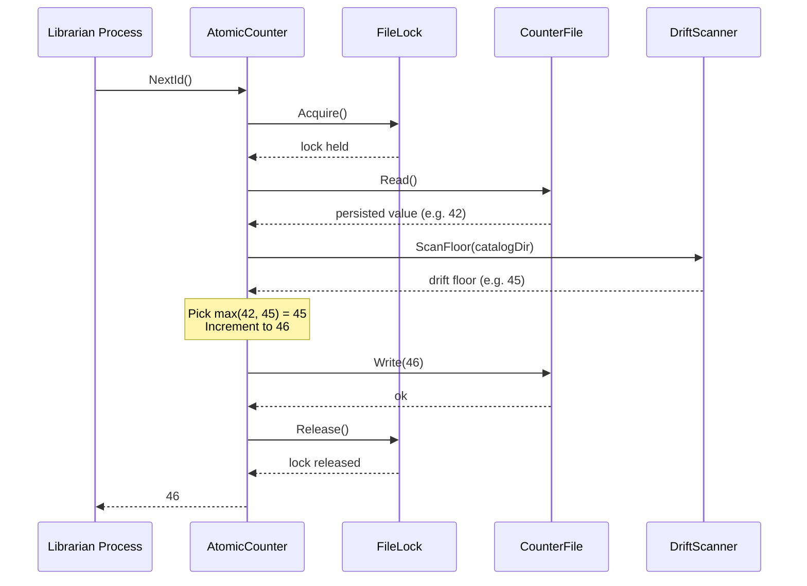

# Architecture

You know the pattern now — a file-locked monotonic counter with drift recovery. This section shows you how the pieces fit together so you can read the code with a map in hand, not a flashlight.

## Components

The implementation has four components. Each one does exactly one job.

**CounterFile** persists the current high-water mark to disk. It reads and writes a single integer from a plain-text file. If the file is missing or corrupt, it returns zero and lets the caller decide what to do next. CounterFile never locks anything — that responsibility belongs elsewhere.

**FileLock** provides mutual exclusion across processes using a filesystem lock file. When you acquire the lock, no other process can acquire it until you release it. If the lock is already held, the caller waits with a configurable timeout. FileLock is purely mechanical — it knows nothing about counters or IDs.

**DriftScanner** walks a directory of existing artifacts (in our demo, catalog card JSON files) and finds the highest ID already in use. This is the drift floor. If someone deletes the counter file or resets it by hand, the drift floor prevents the allocator from reissuing IDs that are already taken. DriftScanner is read-only — it never modifies files.

**AtomicCounter** is the orchestrator. It coordinates the other three components into a single atomic operation: lock, read, scan, pick the higher value, increment, write, unlock, return. Callers interact only with AtomicCounter. They never touch the other components directly.

## How a request flows

When a librarian process requests an accession number, here is the full sequence from call to return.

The key decision happens at the "pick max" step. The counter might say 42, but if three catalog cards were written by a previous run that crashed before updating the counter, the drift scanner finds 45 on disk. AtomicCounter takes the higher value, increments it, and writes 46 back. No ID is ever reused.

## Batch allocation

When a caller requests N IDs at once, the same sequence runs but the increment step reserves a contiguous block. If the max of persisted and drift floor is 45, and the caller requests 3 IDs, AtomicCounter writes 48 to the counter file and returns the range 46, 47, 48. The lock is held for the entire batch — partial allocations cannot happen.

## What each component owns

| Component | Reads | Writes | Depends on |
|---|---|---|---|
| CounterFile | counter file | counter file | nothing |
| FileLock | lock file | lock file | nothing |
| DriftScanner | artifact directory | nothing | nothing |
| AtomicCounter | nothing directly | nothing directly | CounterFile, FileLock, DriftScanner |

AtomicCounter is the only component with dependencies. The other three are leaf nodes you can test in complete isolation.
